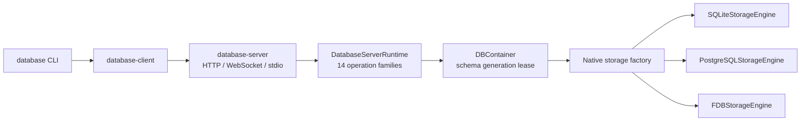

# database-server

`database-server` is the native process host for the canonical DatabaseWire
runtime. It owns HTTP, WebSocket, and private stdio listeners, authentication,
routing validation, TLS configuration, signals, and authoritative shutdown.
Database execution remains in `database-framework`; storage semantics remain
in `storage-kit`.



## Requirements

- macOS 26 or later;
- Swift 6.4 development snapshot `org.swift.64202607231a` for source builds;
- the version-matched `database` executable for the normal standalone UX;
- PostgreSQL 16 when selecting PostgreSQL;
- FoundationDB 7.3 client headers and library when building the server, plus
  an explicit compatible cluster when selecting FoundationDB.

## Standalone use

Install `database` and `database-server` in the same directory. The supported
user-facing entry points are:

```bash
database open ./local.sqlite
database open --memory
database open --storage postgresql \
  --postgres-host 127.0.0.1 \
  --postgres-user database \
  --postgres-database database
database open --storage foundationdb \
  --fdb-cluster-file /etc/foundationdb/fdb.cluster
database serve ./production.sqlite --profile production
```

`database open` starts `database-server stdio` as a private child process and
opens the interactive shell. EOF, cancellation, parent exit, or pipe closure
shuts down the runtime and selected storage engine before the child exits.

`database serve` performs a private bootstrap handshake, stores the raw initial
administrator token in the client Keychain, commits its digest to the server
registry only after that client state succeeds, then starts the foreground
network server. The raw token is never passed through argv, environment
variables, configuration files, history, or logs.

## Server commands

```text
database-server bootstrap --config <path> [storage options] [routing options]
database-server serve --config <path> [--host <host>] [--port <port>]
database-server stdio [storage options]
```

Storage selection is explicit at the server boundary:

| Backend | Required selection |
|---|---|
| SQLite file | `--storage sqlite --path <path>` |
| SQLite memory | `--storage sqlite --memory` |
| PostgreSQL TCP | `--storage postgresql --postgres-host <host> --postgres-user <role> --postgres-database <name>` |
| PostgreSQL socket | `--storage postgresql --postgres-unix-socket <path> --postgres-user <role> --postgres-database <name>` |
| FoundationDB | `--storage foundationdb --fdb-cluster-file <path>` |

FoundationDB never falls back to the system default cluster. PostgreSQL never
accepts a password value through argv or an environment variable;
`--postgres-password-file` names an owner-owned mode-`0600` regular file.

`bootstrap` is a private framed-pipe protocol used by the CLI. It rejects TTY
stdin/stdout. A new credential is retained only after the client writes the
one-byte acceptance acknowledgement.

`serve` publishes HTTP POST and WebSocket DatabaseWire traffic at
`/v1/database`. The default listener is `127.0.0.1:7878`. Network requests must
provide a valid bearer credential and an exact database/tenant/workspace
routing identity before execution reaches the runtime.

`stdio` is an authenticated local-process boundary. Each frame is a four-byte
big-endian payload length followed by one canonical DatabaseWire frame. Zero,
oversized, and truncated frames fail explicitly.

## Configuration and security

The versioned server configuration contains storage, listener, routing, TLS,
frame-limit, and token-registry locations. It never contains a raw credential.
The configuration and registry directories require mode `0700`; files require
mode `0600`. Symbolic-link files and files owned by another user are rejected.
Both files are opened with no-follow semantics and validated from their open
descriptors. Registry replacement fsyncs the new file and parent directory;
the in-memory registry never rolls back after a rename that may already have
committed.

Non-loopback listeners require all of the following before bind:

```text
TLS certificate and private key
        +
non-empty authenticator registry
        +
database, tenant, and workspace routing identity
```

There is no `--no-auth` mode and no fallback database. A valid DatabaseWire
operation failure remains a typed wire response; authentication, routing,
content-type, and body-limit failures remain transport-layer failures.

## Build and verification

```bash
export TOOLCHAINS=org.swift.64202607231a
swift build --product database-server
scripts/xcode-test-harness
DATABASE_CLI_EXECUTABLE=/path/to/database \
DATABASE_SERVER_EXECUTABLE=/path/to/database-server \
DATABASE_FDB_EXECUTABLE=/path/to/database-fdb \
scripts/storage-test-harness
```

After an attributed package build, set `XCODE_TEST_DERIVED_DATA_PATH` to that
exact DerivedData directory so the harness builds only the missing test
products before its isolated `test-without-building` run.

The strict harness requires 22 logical tests, zero failures, zero skips, zero
expected failures, zero runtime warnings, and no internal tool errors. Coverage
includes real HTTP, HTTPS/TLS, WebSocket, and stdio traffic, bootstrap
commit/rollback, token persistence and revocation, configuration and registry
symlink rejection, exact routing, body/frame limits, a real `serve` process,
SIGINT shutdown, and negative readiness.

The storage harness starts disposable SQLite, PostgreSQL 16, and FoundationDB
7.3 environments, opens each through the real CLI → stdio → runtime path,
checks PostgreSQL table creation and protocol readiness, then requires negative
PostgreSQL and FoundationDB readiness after authoritative shutdown.

Release verification rejects local package dependencies. Every dependency must
resolve by URL, and the released server version must exactly match the adjacent
CLI version.
