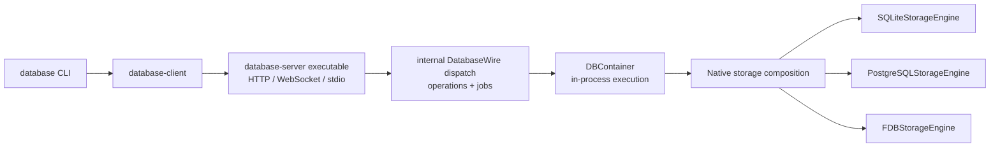

# database-server

`database-server` is the standalone native database daemon. The package has
one supported product: the `database-server` executable launched by the
version-matched `database` command.

The executable owns DatabaseWire frame execution, operation dispatch, remote
commands, durable jobs, schema administration, HTTP, WebSocket, private stdio,
native authentication, routing, TLS, backend startup, signals, and process
shutdown. Internal SwiftPM targets separate those responsibilities for source
organization and testing; they are not exported library products.

Database semantics remain in `database-framework`; storage semantics and
backend implementations remain in `storage-kit`. The server invokes those
layers and does not duplicate query planning, index behavior, or transactions.

Use `database-framework` directly for an in-process or Embedded database and
for application-specific customization. Install `database-server` when a
standalone process or a native HTTP, WebSocket, or stdio endpoint is required.
Applications and platform adapters do not depend on this package as a library.

| Deployment need | Required package |
|---|---|
| In-process application database | `database-framework` |
| Custom schema, indexes, and entity policy | `database-framework` |
| Native DatabaseWire process / remote endpoint | `database-server` executable |

| Layer | Owns | Does not own |
|---|---|---|
| `database-framework` / `Database` | in-process database execution and selected capabilities | listeners, TLS, credentials, signals |
| `database-server` executable | DatabaseWire dispatch, remote commands, jobs, schema administration, native host lifecycle | reusable database execution semantics |



## Requirements

- macOS 26 or later;
- Swift 6.4 development snapshot `org.swift.64202607231a` for source builds;
- the version-matched `database` executable for the normal standalone UX;
- PostgreSQL 16 when selecting PostgreSQL;
- FoundationDB 7.3 client headers and library only when the
  `FoundationDBBackend` trait is selected, plus an explicit compatible cluster.

The default server build selects SQLite only. PostgreSQL and FoundationDB are
independent backend traits; a SQLite-only executable does not link
`libfdb_c`.

## Standalone use

Install `database` and `database-server` in the same directory. The supported
user-facing entry points are:

```bash
database open ./local.sqlite
database open --memory
database open --storage postgresql \
  --postgres-host 127.0.0.1 \
  --postgres-user database \
  --postgres-database database
database open --storage foundationdb \
  --fdb-cluster-file /etc/foundationdb/fdb.cluster \
  --fdb-directory applications \
  --fdb-directory production
database serve ./production.sqlite --profile production
```

`database open` starts `database-server stdio` as a private child process and
opens the interactive shell. EOF, cancellation, parent exit, or pipe closure
shuts down the runtime and selected storage engine before the child exits.

`database serve` performs a private bootstrap handshake, stores the raw initial
administrator token in the client Keychain, commits its digest to the server
registry only after that client state succeeds, then starts the foreground
network server. The raw token is never passed through argv, environment
variables, configuration files, history, or logs.

## Server commands

```text
database-server bootstrap --config <path> [storage options] [routing options]
database-server serve --config <path> [--host <host>] [--port <port>]
database-server stdio [storage options]
```

Storage selection is explicit at the server boundary:

| Backend | Required selection |
|---|---|
| SQLite file | `--storage sqlite --path <path>` |
| SQLite memory | `--storage sqlite --memory` |
| PostgreSQL TCP | `--storage postgresql --postgres-host <host> --postgres-user <role> --postgres-database <name>` |
| PostgreSQL socket | `--storage postgresql --postgres-unix-socket <path> --postgres-user <role> --postgres-database <name>` |
| FoundationDB | `--storage foundationdb --fdb-cluster-file <path> --fdb-directory <component> [...]` |

FoundationDB never falls back to the system default cluster or a default
Directory. Repeating `--fdb-directory` supplies the ordered Directory path.
PostgreSQL never
accepts a password value through argv or an environment variable;
`--postgres-password-file` names an owner-owned mode-`0600` regular file.

`bootstrap` is a private framed-pipe protocol used by the CLI. It rejects TTY
stdin/stdout. A new credential is retained only after the client writes the
one-byte acceptance acknowledgement.

`serve` publishes HTTP POST and WebSocket DatabaseWire traffic at
`/v1/database`. The default listener is `127.0.0.1:7878`. Network requests must
provide a valid bearer credential and an exact database/tenant/workspace
routing identity before execution reaches the runtime.

`stdio` is an authenticated local-process boundary. Each frame is a four-byte
big-endian payload length followed by one canonical DatabaseWire frame. Zero,
oversized, and truncated frames fail explicitly.

## Configuration and security

The versioned server configuration contains one storage configuration, one
explicit database-root selection, listener, routing, TLS, frame-limit, and
token-registry locations by default. SQLite and PostgreSQL require the engine
root. FoundationDB requires a non-empty application-selected Directory; the
host resolves it once and passes the resulting `Subspace` to the framework.
Platform adapters own their platform-specific storage configuration and do not
consume this native server configuration.
The non-default `MultipleBases` trait replaces the single storage field with a
control domain, data domains, and named Base placements. It never contains a
raw credential. Standard format version 3 and `MultipleBases` format version 2
are both strict: unknown keys, mismatched root/backend selection, duplicate
identifiers, missing domain references, duplicate persistent backend
definitions, and empty paths are rejected before any engine is opened. A
standard build rejects placement keys rather than ignoring them.

```json
{
  "formatVersion": 3,
  "storage": {
    "kind": "sqlite",
    "sqlite": { "mode": "file", "path": "/var/lib/database/main.sqlite" }
  },
  "databaseRoot": { "kind": "engine" },
  "host": "127.0.0.1",
  "port": 7878,
  "routing": { "databaseID": "main" },
  "tokenRegistryPath": "/var/lib/database/tokens.json"
}
```

With `MultipleBases`, add the placement fields:

```json
{
  "formatVersion": 2,
  "controlDomain": "primary",
  "domains": [
    {
      "id": "primary",
      "namespace": ["applications", "calendar"],
      "storage": {
        "kind": "sqlite",
        "sqlite": { "mode": "file", "path": "/var/lib/database/main.sqlite" }
      }
    }
  ],
  "placements": [
    { "id": "default", "domain": "primary", "path": ["bases"] }
  ],
  "defaultPlacement": "default"
}
```

`AllRuntimeFeatures` does not imply `MultipleBases`.

The default host opens one engine exactly once and transfers it to
`DBContainer`. With `MultipleBases`, it opens each domain and transfers the
complete topology. FoundationDB's process-global client is initialized once
even when several trait-specific domains use it, and is shut down only after
every owned engine has completed authoritative shutdown. Changing a placement
in configuration does not move an existing Base; movement is a
MultipleBases lifecycle operation.

The configuration and registry directories require mode `0700`; files require
mode `0600`. Symbolic-link files and files owned by another user are rejected.
Both files are opened with no-follow semantics and validated from their open
descriptors. Registry replacement fsyncs the new file and parent directory;
the in-memory registry never rolls back after a rename that may already have
committed.

The token registry is the native persistent-job authentication authority. A
job stores only the token identifier and revalidates revocation, principal, and
roles before every productive slice. The native registry intentionally does
not support claims; registration rejects a non-empty claims object instead of
silently discarding it.

Non-loopback listeners require all of the following before bind:

```text
TLS certificate and private key
        +
non-empty authenticator registry
        +
database, tenant, and workspace routing identity
```

There is no `--no-auth` mode and no fallback database. A valid DatabaseWire
operation failure remains a typed wire response; authentication, routing,
content-type, and body-limit failures remain transport-layer failures.

## Build and verification

```bash
export TOOLCHAINS=org.swift.64202607231a
swift build --product database-server
scripts/xcode-test-harness
DATABASE_CLI_EXECUTABLE=/path/to/database \
DATABASE_SERVER_EXECUTABLE=/path/to/database-server \
DATABASE_FDB_EXECUTABLE=/path/to/database-fdb \
scripts/storage-test-harness
```

The package default intentionally builds a lightweight SQLite standalone host.
The distributed release executable must advertise every selectable standalone
backend and is built through the package-owned release gate:

```bash
export TOOLCHAINS=org.swift.64202607231a
scripts/release-build
```

`scripts/release-build` disables the package defaults and selects
`AllRuntimeFeatures,AllStorageBackends`. Building a distributable executable
with the default SQLite-only graph is not a release artifact.

After an attributed package build, set `XCODE_TEST_DERIVED_DATA_PATH` to that
exact DerivedData directory so the harness builds only the missing test
products before its isolated `test-without-building` run.

The strict harness requires 279 logical tests for the standard graph. Set
`DATABASE_SERVER_TEST_TRAITS=MultipleBases` to select that trait in an isolated
source copy and require 302 tests. Both graphs require zero failures, zero
skips, zero expected failures, zero runtime warnings, and no internal tool
errors. Coverage
includes real HTTP, HTTPS/TLS, WebSocket, and stdio traffic, bootstrap
commit/rollback, token persistence and revocation, configuration and registry
symlink rejection, exact routing, body/frame limits, a real `serve` process,
SIGINT shutdown, and negative readiness.

The storage harness starts disposable SQLite, PostgreSQL 16, and FoundationDB
7.3 environments, opens each through the real CLI → stdio → runtime path,
checks PostgreSQL table creation and protocol readiness, then requires negative
PostgreSQL and FoundationDB readiness after authoritative shutdown.

Release verification rejects local package dependencies. Every dependency must
resolve by URL, and the released server version must exactly match the adjacent
CLI version.

## License

Licensed under the [MIT License](LICENSE).
